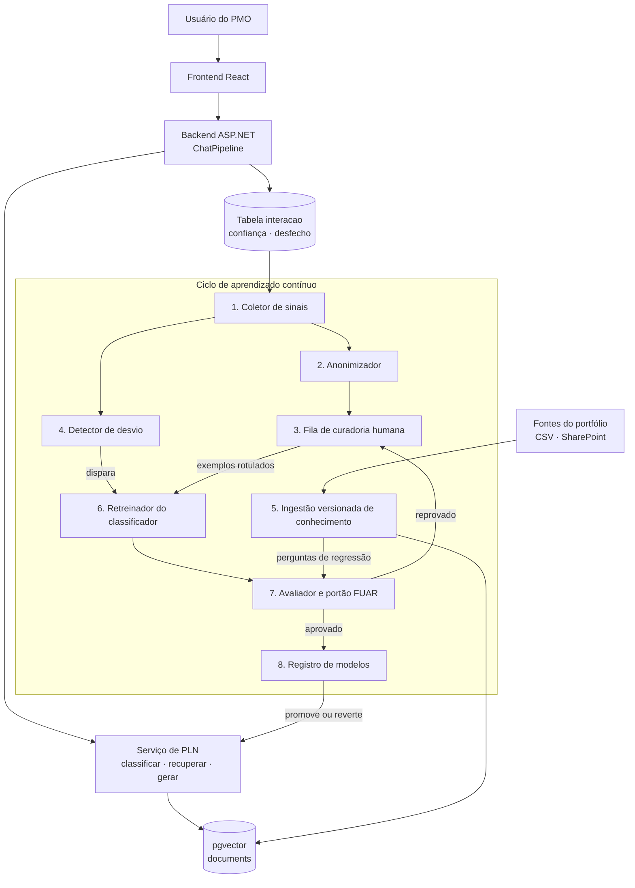

# topicos-avancados-ponderada
# Aprendizado contínuo no Swoosh

Alternativa 1: como fomentar o aprendizado contínuo no sistema conversacional.

## 1. Introdução

O Swoosh é um agente conversacional (texto e voz) que apoia o PMO do Metrô-SP na consulta e atualização do portfólio de projetos. Ele guarda conhecimento em dois lugares:

- No classificador de intenção, que é paramétrico: embeddings congelados seguidos de uma regressão logística, treinada uma única vez sobre 375 frases escritas pela equipe (`src/nlp/dataset.py`).
- Na base vetorial do RAG, que é externa ao modelo: trechos do portfólio e dos normativos em `pgvector`, a partir dos quais a resposta é montada por templates.

Os dois envelhecem. O portfólio muda todo mês (avanço físico, riscos, marcos), projetos novos entram, e os usuários reais formulam pedidos de um jeito que o corpus sintético não previu. Hoje nada disso volta para o sistema: o modelo só muda se alguém editar o dataset e rodar `python -m nlp.train` à mão, e a tabela `interacao` já registra `confianca` e `desfecho` (`aceito`, `corrigido`, `reformulado`) sem que ninguém os use.

Jang et al. (2022) formalizam esse problema como *Continual Knowledge Learning* (CKL) e separam o conhecimento em três tipos, que se aplicam diretamente ao Swoosh:

| Tipo (JANG et al., 2022) | No Swoosh | O que deve acontecer |
|---|---|---|
| Invariante no tempo | Normativos, conceitos de gestão, as cinco intenções | Não pode ser esquecido |
| Desatualizado | Status, avanço e riscos de um projeto | Deve ser substituído |
| Novo | Projetos, documentos e formas de perguntar inéditos | Deve ser adquirido |

Atualizar não é trivial. Continuar o treino apenas com dados novos causa esquecimento catastrófico (MCCLOSKEY; COHEN, 1989; KIRKPATRICK et al., 2017). Misturar dados antigos e novos tampouco garante que o modelo fique com a informação recente quando a base antiga é muito maior (JANG et al., 2022). E a recuperação externa (LEWIS et al., 2020) não resolve sozinha: se o trecho velho e o novo convivem no índice, o agente pode responder com o dado vencido.

Três achados de Jang et al. (2022) orientam a proposta:

1. Métodos que congelam os parâmetros originais e treinam parâmetros adicionais tiveram o melhor equilíbrio entre reter e aprender.
2. Ver os mesmos dados repetidas vezes é causa crítica de esquecimento.
3. O equilíbrio precisa ser medido, e os autores propõem a métrica FUAR, a razão entre o conhecimento esquecido e o conhecimento atualizado ou adquirido.

## 2. Solução Proposta

A proposta fecha o ciclo entre uso e atualização com dois caminhos: o conhecimento factual é atualizado fora dos parâmetros, por ingestão versionada no RAG; o classificador é atualizado por retreino controlado, com o codificador congelado e um portão de qualidade antes de qualquer promoção.

### 2.1 Diagrama de arquitetura

### 2.2 Responsabilidades de cada módulo

| # | Módulo | Responsabilidade |
|---|---|---|
| 1 | Coletor de sinais | Lê a tabela `interacao` em lote e seleciona candidatos a aprendizado: confiança abaixo do limiar do RF08, `desfecho` igual a `corrigido` ou `reformulado`, e consultas em que a recuperação não achou trecho. Acrescenta um controle explícito de "resposta útil / não útil" na interface. |
| 2 | Anonimizador | Reutiliza `src/nlp/anonymizer.py` para remover dados pessoais antes que qualquer frase real entre no corpus de treino (LGPD). |
| 3 | Fila de curadoria humana | Tela em que um analista do PMO confirma ou corrige o rótulo de intenção de cada candidato. Nenhum exemplo entra no treino sem revisão, o que impede que frases maliciosas envenenem o modelo. Frases quase idênticas são deduplicadas, em linha com o achado 2. |
| 4 | Detector de desvio | Acompanha por semana a confiança média, a taxa de reformulação e a proporção de cada intenção. Dispara o retreino quando há desvio relevante ou quando a fila acumula um número mínimo de exemplos aprovados, em vez de retreinar por calendário. |
| 5 | Ingestão versionada de conhecimento | Ao receber dados novos do portfólio, gera trechos e embeddings e grava com `valido_de`, `valido_ate` e versão. O trecho substituído é marcado como vencido, não convive com o novo; a busca filtra apenas os vigentes. É o tratamento do conhecimento "desatualizado" sem tocar em parâmetros. |
| 6 | Retreinador do classificador | Mantém o MiniLM congelado e treina somente a camada de classificação (análogo ao achado 1). Como o corpus original é pequeno, treina sempre sobre o corpus original inteiro somado aos exemplos novos, um *rehearsal* completo que o cenário do artigo não permitia. |
| 7 | Avaliador e portão FUAR | Avalia o candidato em dois conjuntos fixos: o invariante (teste original, nunca usado em treino) e o novo (exemplos reais curados, separados do treino). Calcula `FUAR = max(0, acerto_invariante_antes − acerto_invariante_depois) / max(0, acerto_novo_depois − acerto_novo_antes)`. Só aprova se FUAR < 1, se o macro-F1 continuar acima da meta do RNF01 e se o *recall* da classe `malicioso` não cair. Para o RAG, reexecuta perguntas de regressão cuja resposta deve vir do trecho vigente. |
| 8 | Registro de modelos | Guarda cada versão do classificador com seu dataset, métricas e data. Promove o aprovado para o serviço de PLN, começando em modo sombra (classifica em paralelo sem responder), e permite reverter para a versão anterior com um comando. |

## 3. Conclusão

Considero a proposta adequada ao Swoosh por três motivos: 
1. Ela não tenta ensinar fatos do portfólio a um modelo: fatos mudam todo mês e ficam melhor numa base versionada, onde atualizar é substituir um registro. O retreino fica reservado ao que de fato é paramétrico, a compreensão da intenção. 

2. Ela aproveita o que já existe (a tabela `interacao`, o anonimizador, o script de treino), de modo que a maior parte do trabalho é ligar peças. 

3. Ela torna o esquecimento mensurável: sem o portão FUAR, um retreino que melhora as frases novas e piora a detecção de prompts maliciosos passaria despercebido.

Há limites. O artigo estuda modelos de centenas de milhões de parâmetros; a transposição para um classificador linear é uma analogia, e o FUAR aqui é uma adaptação minha, não a métrica original. O conjunto de teste é pequeno, então diferenças de poucos pontos podem ser ruído, e o portão precisa usar validação cruzada. A curadoria depende de tempo do PMO, que é justamente o recurso que o projeto quer poupar. E se o Swoosh passar a usar um modelo generativo, a discussão de expansão de parâmetros (LoRA, adaptadores) volta a valer integralmente.

Quanto ao esforço, estimo de duas a três sprints para uma equipe como a nossa: uma para o coletor, a anonimização e a fila de curadoria; uma para a ingestão versionada, que exige migração de esquema e mudança na busca; e uma para o retreinador, o portão e o registro de modelos. O item de maior risco não é técnico: é obter volume suficiente de interações reais e manter a curadoria em funcionamento depois da entrega.

## 4. Referências Bibliográficas

JANG, Joel *et al*. Towards continual knowledge learning of language models. *In*: INTERNATIONAL CONFERENCE ON LEARNING REPRESENTATIONS, 10., 2022, [*S. l.*]. Proceedings [...]. [*S. l.*]: ICLR, 2022. Disponível em: https://arxiv.org/abs/2110.03215. Acesso em: 1 out. 2026.

KIRKPATRICK, James *et al*. Overcoming catastrophic forgetting in neural networks. Proceedings of the National Academy of Sciences, Washington, v. 114, n. 13, p. 3521-3526, 2017.

LEWIS, Patrick *et al*. Retrieval-augmented generation for knowledge-intensive NLP tasks. *In*: CONFERENCE ON NEURAL INFORMATION PROCESSING SYSTEMS, 34., 2020, [*S. l.*]. Proceedings [...]. [*S. l.*]: NeurIPS, 2020. Disponível em: https://arxiv.org/abs/2005.11401. Acesso em: 1 out. 2026.

MCCLOSKEY, Michael; COHEN, Neal J. Catastrophic interference in connectionist networks: the sequential learning problem. Psychology of Learning and Motivation, [*S. l.*], v. 24, p. 109-165, 1989.
